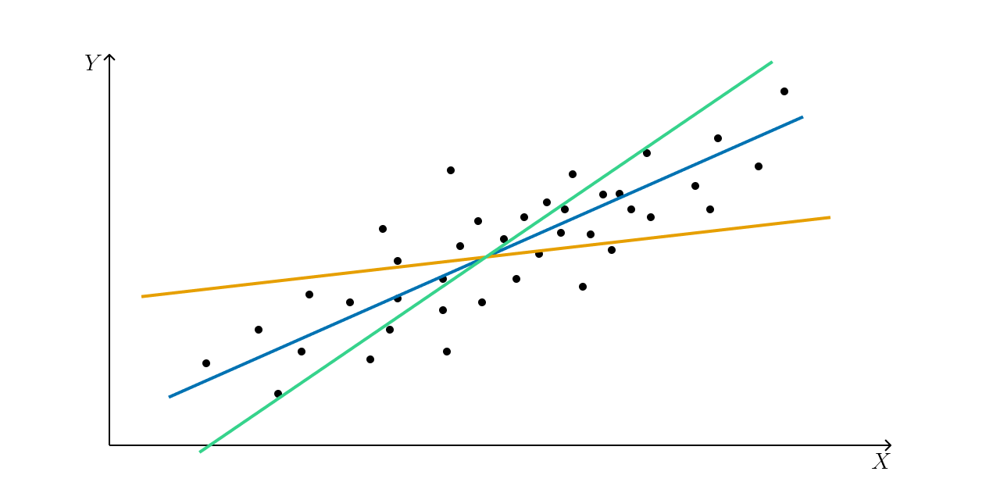
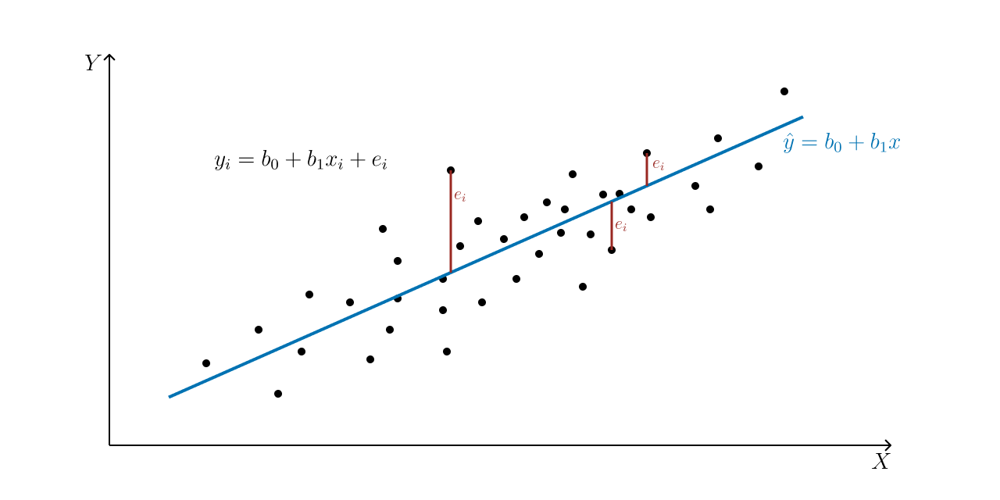
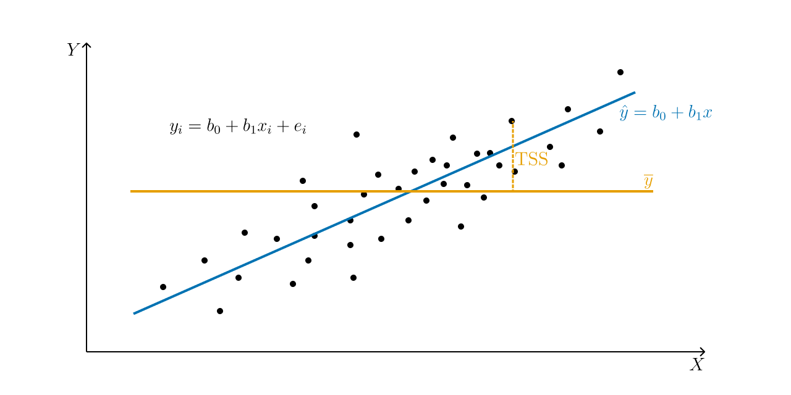
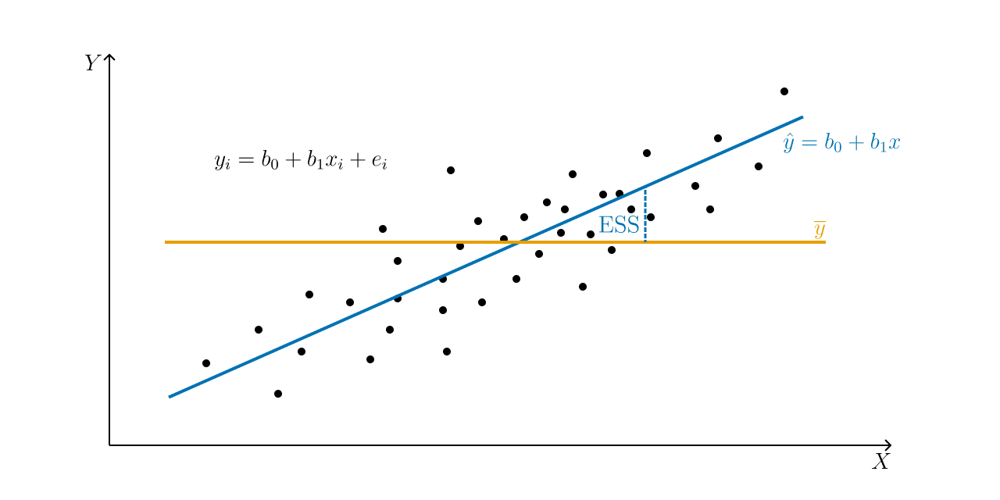
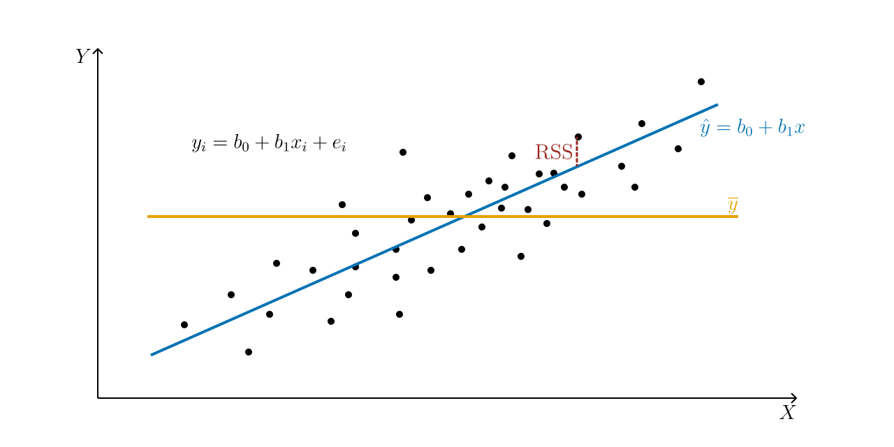
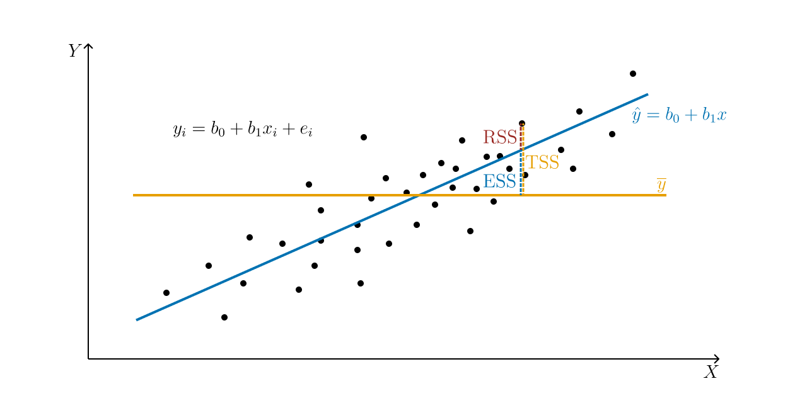

# Простая линейная регрессия {#infer-simplelinear}

Ненадолго откатимся обратно к корреляции. Она позволяет тестировать гипотезы о связях между количественными переменными. Однако кроме проверки наличия/отсутствия связей между переменными, нас ещё интересует, как бы мы могли управлять одними переменными с помощью других. Для этого необходимо построение некоторой модели.

Когда мы строили диаграммы рассеяния, мы добавляли на них линию тренда (@fig-cor-scheme-pos-trend), которая отражала линейную составляющую связи между визуализируемыми переменными.

Эта линия и есть интересующая нас модель. Визуально мы такую линию проведём очень легко, а вот как нам получить её математическое выражение?

## Формализация модели {#simplelinear-formalization}

Первое, что нужно вспомнить --- это общее уравнение прямой. Оно выглядит так:

$$
y = kx + b,
$$

где $k$ --- угловой коэффициент (slope), задающий угол наклона прямой к оси $x$, а $b$ --- свободный член (intercept), который обозначает ординату точки пересечения прямой с осью $y$.

Итого, чтобы получить уравнение прямой, нам надо знать два этих числа. Что у нас есть, для этого есть? У нас есть наши наблюдения — то есть $x$ и $y$. Мы привыкли к тому, что $x$ и $y$ являются неизвестными, но теперь, когда мы ищем уравнение прямой на основе имеющихся измерений, ситуация изменяется.

Запишем уравнение, используя общепринятые обозначения.

$$
y = b_0 + b_1 x
$$

Уравнение отражает зависимость между переменными $x$ и $y$, значения которых нам известны, так как у нас есть результаты измерений, а вот неизвестными теперь являются $b_0$ и $b_1$.

В терминах **статистической модели**:

- переменная $y$ называется *зависимой*, *предсказываемой*, *целевой* переменной, или *регрессантом*
- переменная $x$ носит названия *независимая переменная*, *предиктор* или *регрессор*
- $b_0$ и $b_1$ называются *коэффициентами*, или *параметрами*, *модели*.

:::{.callout-important appearance="simple"}
Несмотря на использование терминов *зависимая переменная* и *независимая переменная*, необходимо чётко понимать, что сам регрессионный анализ, как и корреляционный, ничего нам не говорит о причинности.

Мы выражаем $y$ через $x$, но точно так же можем выразить и $x$ через $y$ --- и модель будет подобрана, так как нет никаких математических ограничений. Поэтому если мы хотим сделать по результатам регрессионного анализа сделать вывод о причинно-следственной связи между явлениями, нам необходимо либо серьёзное теоретическое обоснование нашего вывода --- почему мы выбрали в качестве зависимой и независимой переменных именно эти? --- либо использование экспериментального дизайна исследования, где мы обосновываем причинно-следственный характер связи именно через дизайн эксперимента.
:::

## Идентификация модели {#simplelinear-identification}

Идентификация модели сводится к нахождению коэффициентов $b_0$ и $b_1$. Мы хотим провести такую прямую, которая наилучшим образом будет описывать имеющуюся в данных закономерность, поэтому необходимо найти критерий, по которому мы будем определять «хорошесть» нашей прямой.

Графически мы делаем вот что: проводим прямую через облако точек. Очевидно, что мы можем провести множество разных прямых: одни будут лучше описывать закономерность, другие --- хуже. Так, оранжевая прямая описывает закономерность совсем плохо, зелёная --- лучше, а вот синяя --- именно то, что нам нужно (@fig-simplelinear-trends).

:::{#fig-simplelinear-trends}

Различные «линии тренда» для данного облака точек.
:::

Из картинки также очевидно, что даже синяя прямая не описывает наши данные максимально точно --- не все точки попали на прямую. Ясно, что  прямую, на которую попадут все точки, мы провести не сможем --- как минимум потому, что прямая проходит только через две точки, а у нас точек целое облако. Поэтому любая построенная нами модель будет содержать *ошибку* --- вновь по причине вариативности и неопределенности данных (@fig-simplelinear-model-graph).

:::{#fig-simplelinear-model-graph}

Графическое представление модели [простой] линейной регрессии
:::

Получается следующая ситуация:

* мы хотим построить модель вида $\hat y_i = b_0 + b_1 x_i$
* при этом каждое отдельное наблюдение может быть описано как $y_i = b_0 + b_1 x_i + e_i$
* значит, модель должна ошибаться ($e_i$) как можно меньше, чтобы «хорошо» описывать нашу закономерность.

Игрек в шляпке ($\hat y$) показывает, что это *моделируемое* значение нашей целевой переменной, и оно отличается от того, которое есть в данных.

Ошибки модели $e_i$ также называются **остатками (residuals)**, то есть то, что модель не смогла объяснить. Собственно, задача идентификации модели --- минимизировать остатки (ошибки) этой модели, подбирая её параметры. Эта задача решается через *минимизацию квадрата ошибок*, поэтому метод называет **методом наименьших квдратов (МНК) (ordinary least squares, OLS)**:

$$
\begin{split}
Q_{\text{res}} &= \sum_{i=1}^n e_i = \sum_{i=1}^n (y_i - \hat y_i)^2 = \\
&= \sum_{i=1}^n \big( y_i - (b_0 + b_1 x_i) \big)^2 \to \min_{b_0,\, b_1}
\end{split}
$${#eq-resmin}

#### Метод наименьших квадратов {#simplelinear-ols}

:::{.callout-note title="Математика МНК" collapse=true}

Если внимательно посмотреть на условие минимизации ошибки модели (@eq-resmin), то можно увидеть, что оно представляет собой функцию двух аргументов:

$$
f(b_0, b_1) = \sum_{i=1}^n (y_i - b_0 - b_1 x_i)^2
$$

Это квадратичная функция, и чтобы нам дальше удобнее было с ней работать, раскроем скобки:

$$
\begin{split}
f(b_0,b_1) &= \sum_{i=1}^n (y_i - b_0 - b_1 x_i)(y_i - b_0 - b_1 x_i) = \\
&= \sum_{i=1}^n y_i^2 - 2 x_i y_i b_1 - 2y_i b_0 + x_i^2 b_1^2 + b_0^2 + 2x_i b_1b_0
\end{split}
$$

Чтобы определить, при каких значениях $b_0$ и $b_1$ функция будет принимать минимальное значение, нужно взять две частные производные по $b_0$ и $b_1$ и приравнять их к нулю.

Берём частные производные:

$$
\begin{split}
\frac{\partial f(b_0, b_1)}{\partial b_0} &= \sum_{i=1}^n (-2y_i + 2b_0 + 2x_ib_1) = -2 \sum_{i=1}^n \big(y_i - (b_0 - b_1x_i) \big) \\
\frac{\partial f(b_0, b_1)}{\partial b_1} &= \sum_{i=1}^n (-2 x_i y_i + 2 x_i^2 b_1+ 2 x_i b_0) = -2 \sum_{i=1}^n \big(y_i - (b_0 - b_1x_i) \big) x_i
\end{split}
$$

Приравниваем производные к нулю и решаем систему уравнений:

$$
\begin{split}
&\cases{
-2 \sum_{i=1}^n \big( y_i - (b_0 + b_1 x_i) \big) = 0, \\
-2 \sum_{i=1}^n \big( y_i - (b_0 + b_1 x_i) \big)x_i = 0; \\
} \\
&\cases{
b_1 \sum_{i=1}^n x_i + \sum_{i=1}^n b_0 = \sum_{i=1}^n y_i, \\
b_1 \sum_{i=1}^n x_i^2 + b_0 \sum_{i=1}^n x_i = \sum_{i=1}^n x_i y_i; \\
} \\
&\cases{
b_1 \sum_{i=1}^n x_i + n b_0 = \sum_{i=1}^n y_i, \\
b_1 \sum_{i=1}^n x_i^2 + b_0 \sum_{i=1}^n x_i = \sum_{i=1}^n x_i y_i; \\
} \\
&\cases{
b_0 = \dfrac{\sum_{i=1}^n y_i}{n} - b_1 \dfrac{\sum_{i=1}^n x_i}{n} = \overline{y} - b_1 \overline x, \\
b_1 = \dfrac{n \sum_{i=1}^n x_i y_i - \sum_{i=1}^n x_i \cdot \sum_{i=1}^n y_i}{n \sum_{i=1}^n x_i^2 - (\sum_{i=1}^n x_i )^2} = \dfrac{\overline{xy} - \overline{x} \cdot \overline{y}}{\sigma^2_X}
}
\end{split}
$$

:::

В сухом остатке из метода наименьших квадратов на надо вынести вот что:

- задача индентификации модели линейной регрессии **имеет аналитическое решение** --- мы можем подобрать коэффициенты модели, опираясь только на имеющиеся данные
- и оно вот такое

$$
\cases{
b_0 = \overline{y} - b_1 \overline x, \\
b_1 = \dfrac{\overline{xy} - \overline{x} \cdot \overline{y}}{\sigma^2_X}
}
$$

Это, безусловно, радостно и приятно.

## Тестирование качества модели {#simplelinear-testing}

Супер! Мы построили модель! Теперь надо понять, насколько она хороша для наших данных. Но стойте! --- мы же изначально подбирали модель так, чтобы она была «хороша» --- её ошибка должна быть минимальной. Да, это так. Однако нам надо сделать шаг назад и прояснить ряд моментов, на которые мы имплицитно опираемся, но пока ещё не проговорили.

До этого мы работали только с математической стороной вопроса, совершенно не касаясь собственно статистики. Мы помним, что работая с выборкой, мы хотим получить информацию о генеральной совокупности. Строя модель, мы предполагаем, что в генеральной совокупности есть связь, которая описывается следующим образом:

$$
y_i = \beta_0 + \beta_1 x_i + \varepsilon_1,
$$

где $\beta_0$ и $\beta_1$ --- популяционные параметры модели, то есть значения коэффициентов в генерально совокупности.

Таким образом, построив модель, мы получили оценки генеральных параметров:

$$
b_0 = \hat \beta_0, \quad b_1 = \hat \beta_1, e_i = \hat \varepsilon_i
$$
 
Кроме того, при построении модели мы также исходили из нескольких предположений.

- Во-первых, мы считали, что **связь между предикторами и зависимой переменной линейная**.
- Во-вторых, мы предположили, что наша модель полностью улавливает тренд закономерности, то есть остатки (ошибки) модели случайны.
    - Их среднее равно нулю: $\overline \varepsilon = 0$
    - и остатки модели не коррелируют между собой: $\text{cor} \underset{i \neq j}{(\varepsilon_i, \varepsilon_j)} = 0$
- Ну, а раз остатки заключают в себе случайный компонент модели, то они должны быть распределены нормально $\varepsilon \thicksim \mathcal{N} (0, \sigma ^2)$,
    - причём их дисперсия должна быть одинакова при любых значениях предиктора: $\sigma_i^2 = \sigma^2$.

Так-с, ну, теперь можно приступать с анализу модели.

### Коэффициент детерминации {#simplelinear-r2}

Первое, что хочется понять --- насколько наша модель информативна. Иначе говоря, сколько дисперсии наших данных она смогла объяснить. На практике работают не с дисперсией, а с суммой квадратов, что почти то же самое.

Вся изменчивость наших данных (@fig-simplelinear-tss), или **общая сумма квадратов (total sum of squares, TSS)** определяется так:

$$
\text{TSS} = \sum_{i=1}^n (\overline y - y_i)^2
$$

:::{#fig-simplelinear-tss}

Общая сумма квадратов (обозначено слагаемое, соответствующее одному наблюдению)
:::

Некоторую часть этой изменчивости объясняет модель (@fig-simplelinear-ess) --- это **объясненная сумма квадратов (explained sum of squares, ESS)**:

$$
\text{ESS} = \sum_{i=1}^n (\overline y - \hat y_i)^2
$$

:::{#fig-simplelinear-ess}

Объясненная сумма квадратов (обозначено слагаемое, соответствующее одному наблюдению)
:::

Другую часть этой изменчивости модель не улавливает, и она остаётся необъяснённой (остаточной) --- **остаточная сумма квадратов (residual sum of squares, RSS)**:

$$
\text{RSS} = \sum_{i=1}^n (\hat y_i - y_i)^2
$$

:::{#fig-simplelinear-rss}

Остаточная сумма квадратов (обозначено слагаемое, соответствующее одному наблюдению)
:::

Очевидно (@fig-simplelinear-rssesstss), что

$$
\text{TSS} = \text{ESS} + \text{RSS}
$$

:::{#fig-simplelinear-rssesstss}

Остаточная сумма квадратов (обозначено слагаемое, соответствующее одному наблюдению)
:::

:::{.callout-note title="Не очевидно" appearance="simple" collapse=true}
Распишем $\text{TSS}$ по формуле: 

$$
\begin{split}
\text{TSS} &= \sum_{i=1}^n (y_i - \overline y)^2 = \sum_{i=1}^n (y_i - \hat y_i + \hat y_i - \overline y_i)^2 = \\
&= \sum_{i=1}^n \big( (y_i - \hat y_i) + (\hat y_i - \overline y_i) \big)^2 = \\
&= \sum_{i=1}^n (y_i - \hat y_i)^2 + \sum_{i=1}^n (\hat y_i - \overline y_i)^2 + 2\sum_{i=1}^n (y_i - \hat y_i) (\hat y_i - \overline y_i) = \\
&= \text{RSS} + \text{ESS} + 2\sum_{i=1}^n (y_i - \hat y_i) (\hat y_i - \overline y_i)
\end{split}
$$

Почти то, что нужно. Если мы покажем, что $\sum_{i=1}^n (y_i - \hat y_i) (\hat y_i - \overline y_i) = 0$, то получим нужное соотношение.

Вспомним, что $\hat y_i= b_0 + b_1 x_i$, $b_0 = \overline y - b_1 \overline x$, a $b_1 = \dfrac{\sum_{i=1}^n (x_i - \overline x)(y_i - \overline y)}{\sum_{i=1}^n (x_i - \overline x)^2}$. Тогда

$$
\begin{split}
&\sum_{i=1}^n (y_i - \hat y_i) (\hat y_i - \overline y_i) = \sum_{i=1}^n (y_i - b_0 - b_1 x_i) (b_0 + b_1 x_i - \overline y_i) = \\
&= \sum_{i=1}^n (y_i - \overline y + b_1 \overline x + b_1 x_i) (\overline y - b_1 \overline x + b_1 x_i - \overline y_i) = \\
&= \sum_{i=1}^n \big( (y_i - \overline y) - b_1 (x_i - \overline x) \big) \cdot b_1 (x_i - \overline x)  = \\
&= \sum_{i=1}^n \big( b_1(x_i - \overline x) (y_i - \overline y) - b_1^2 (x_i - \overline x)^2 \big ) = \\
&= b_1 \sum_{i=1}^n (x_i - \overline x) (y_i - \overline y) - b_1^2 \sum_{i=1}^n (x_i - \overline x)^2 = \\
&= \frac{\sum_{i=1}^n (x_i - \overline x)(y_i - \overline y)}{\sum_{i=1}^n (x_i - \overline x)^2} \cdot \sum_{i=1}^n (x_i - \overline x) (y_i - \overline y) - \\
&- \left( \frac{\sum_{i=1}^n (x_i - \overline x)(y_i - \overline y)}{\sum_{i=1}^n (x_i - \overline x)^2} \right)^2 \cdot \sum_{i=1}^n (x_i - \overline x)^2 = \\
&= \frac{\big(\sum_{i=1}^n (x_i - \overline x) (y_i - \overline y) \big)^2}{\sum_{i=1}^n (x_i - \overline x)^2} - 
\frac{\big(\sum_{i=1}^n (x_i - \overline x) (y_i - \overline y) \big)^2 \cdot 
(x_i - \overline x)^2}{\big( (x_i - \overline x)^2 \big)^2} = \\
&= \frac{\big(\sum_{i=1}^n (x_i - \overline x) (y_i - \overline y) \big)^2}{\sum_{i=1}^n (x_i - \overline x)^2} - 
\frac{\big(\sum_{i=1}^n (x_i - \overline x) (y_i - \overline y) \big)^2}{\sum_{i=1}^n (x_i - \overline x)^2} = 0
\end{split}
$$

:::

В качестве метрики информативности модели используется коэффициент детерминации $R^2$, который вычисляется по формуле:

$$
R^2 = \frac{\text{ESS}}{\text{TSS}} = \frac{1 - \text{RSS}}{\text{TSS}},
$$

из чего следует, что $0 \leq R^2 \leq 1$. По сути, коэффициент детерминации может быть интерпретирован как *доля дисперсии данных, которую смогла объяснить модель*.

Считается, что если модель объясняется 0.8 и более дисперсии данных, то она хороша, хотя этот порог очень сильно зависит от конкретной задачи и исследовательской области.

Кстати, вопрос на подумать: может ли коэффициент детерминации быть отрицательным?

### Статистическая значимость модели

На основе всё тех же сумм квадратов мы можем сделать вывод о том, насколько в целом наша модель статистически значима. Для этого нам надо заняться тестированием некоторой статистической гипотезы. Она формулируется так (в случае простой линейной регрессии):

$$
\begin{split}
&H_0 : \beta_1 = 0 \\
&H_1: \beta_1 \neq 0
\end{split}
$$

Для тестирования данной гипотезы используется следующая статистика:

$$
F = \frac{\text{MS}_\text{e}}{\text{MS}_\text{r}} = \frac{\text{ESS} / \text{df}_\text{e}}{\text{RSS} / \text{df}_\text{r}} \overset{H_0}{\thicksim} F(\text{df}_\text{e}, \text{df}_\text{r}),
$$

где $\text{MS}_\text{e}$ --- средний объясненный квадрат, $\text{MS}_\text{r}$ --- средний остаточный квадрат, $\text{df}_\text{e} = p - 1$, $\text{df}_\text{r} = n-p$, $p$ --- количество предикторов в модели, $n$ --- число наблюдений.

Как и всегда, для $F$-статистики рассчитывается p-value, на основе значения которого мы делаем статистический вывод о статистическом равенстве коэффициента детерминации нулю, а следовательно, о статистической значимости модели в целом.

### Статистическая значимость отдельных предикторов

Если модель значима в целом, значит среди её коэффициентов есть те, которые статистически отличны от нуля. Иначе говоря, есть такие предикторы, которые значимо связаны с нашей целевой переменной. В случае простой линейной регрессии предиктора всего один, поэтому если модель в целом статистически значима, то и коэффициент при предикторе будет не ноль.

Статистическая значимость коэффициента тестируется так:

$$
\begin{split}
H_0: \beta_1 = 0 //
H_1: \beta_1 \neq 0 //
\end{split}
$$

$$
t = \frac{b_1 - \beta_1}{\text{se}_{b_1}} \overset{\beta_1 = 0}{=} \frac{b_1}{\text{se}_{b_1}} \overset{H_0}{\thicksim} t(df), \, df = n - p - 1
$$

Хвала небесам, оно все считается само.

### Результаты регрессионного анализа

Результаты тестирования значимости модели в целом обычно описывают в тексте: «регрессионная модель оказалась статистически значима и объяснила xx% дисперсии данных ($F(\text{df}_1, \text{df}_2) = x.xx, \, p = .xxx, \, R^2_\text{adj} = 0.xx$)»[^r2-adj].

[^r2-adj]: В данном примере указан $R^2_\text{adj}$, или скорректированный коэффициент детерминации, поскольку таков стандарт представления результатов. Что это такое и чем он отличается от обычного $R^2$ мы узнаем в следующей главе.

Результаты тестирования значимости предикторов представляются в табличке:

:::{#tbl-simplelinear-results}
| Предиктор | Значение коэффициента | Стандартная ошибка | t | p |
|:---|---:|---:|---:|---:|
| Интерсепт | $b_0$ | $\text{SE}_{b_0}$ | $t_{b_0}$ | $\mathsf p$ |
| `Угловой коэффициент` | $b_1$ | $\text{SE}_{b_1}$ | $t_{b_1}$ | $\mathsf p$ |

Общая схема представления результатов тестирования статистической значимости предикторов
:::

<!---
Посмотрим на данные из индустрии. У нас есть данные некоторой компании, в которых есть переменная fot (ФОТ — фонд оплаты труда) и переменная grade_score (интегральный балл по грейду). С первой всё ясно — количество денег, которое заложено на оплату труда сотрудника. Со второй переменной всё чуть сложнее — это оценка сотрудника, рассчитываемая по некоторой схеме, неизвестной нам, ибо NDA1.

Ну, да бох с ним, как там этот грейд рассчитывается. Нам ведь для построения регрессии важно что — чтобы была некоторая целевая количественная переменная, и некоторый предиктор, тоже количественный. У нас есть и то, и другое.

Посмотрим на связь двух переменных:

Картинка местами прикольная и даже забавная, но в целом мы наблюдаем некоторую положительную взаимосвязь между переменными, линия тренда с положительным наклоном — норм, можно пытаться это всё дело моделировать.

Регрессионный анализ нам покажет что-то такое:

## 
## Call:
## lm(formula = fot ~ grade_score, data = ds)
## 
## Residuals:
##     Min      1Q  Median      3Q     Max 
## -171435  -28467   -3305   15470  418192 
## 
## Coefficients:
##               Estimate Std. Error t value Pr(>|t|)    
## (Intercept) -7.483e+04  3.358e+03  -22.28   <2e-16 ***
## grade_score  1.118e+00  2.433e-02   45.98   <2e-16 ***
## ---
## Signif. codes:  0 '***' 0.001 '**' 0.01 '*' 0.05 '.' 0.1 ' ' 1
## 
## Residual standard error: 47450 on 1993 degrees of freedom
## Multiple R-squared:  0.5147, Adjusted R-squared:  0.5145 
## F-statistic:  2114 on 1 and 1993 DF,  p-value: < 2.2e-16
Таблица невероятно похожа на результаты дисперсионного анализа, не так ли? Падазритильна…

Некоторые отличия, конечно, есть — пройдемся по колонкам:

Estimate — оценка коэффициента при нашем предикторе, то есть  
b
1
 
Std. Error — стандартная ошибка коэффициента (нужна для вычисления следующей колонки)
t value — t-статистика, используемая для тестирования статистической значимости предиктора
это уже знакомый нам t-тест, который был в корреляционном анализе
Pr(>|t|) — это так обозвали p-value, которые рассчитывается для t-статистики
Кроме таблицы, нам нужны еще две последние строчки, в которых указан  
R
2
  и  
F
 -статистика со своим p-value.

Что можно заключить по результатам анализа?

Во-первых, что модель в целом статистически значима (F(1, 1993) = 2114, p < .001) и объясняет 51% дисперсии данных.
Во-вторых, что предиктор модели (grade_score, интегральный балл по грейду) также статистически значим.
Ну, красота.
--->

### Интерпретация коэффициента при предикторе

> — А ежели наш предиктор значим, то это же получается, что коэффициент при нем статистически отличен от нуля?
> — Да, именно так.
> — А можем ли мы его каким-либо образом содержательно проинтерпретировать?
> — Да.
> — А как?
> — Ровно так, как [возможно] говорили на математике.

Угловой коэффициент показывает, на сколько изменится целевая переменная при увеличении предиктора на единицу.

<!--- Поэтому мы можем сказать, что при увеличении ингерального балла по грейду на единицу фонд оплаты труда сотрудника возрастает на 1118₽.
Дорого-богато.
--->

Интерcепт оказывается интерпретабелен далеко не всегда, поэтому ему, как правило, уделяет меньше внимания.

<!---
## Диагностика модели {#simplelinear-diagnostics}

Окей, пусть наша модель значима в целом, а значит значим и её предиктор, она объясняет приемлемую долю дисперсии данных. Неужели этого недостаточно?

Недостаточно. При построении модели мы исходили из ряда предпосылок. Напомним их:

- линейность связи
- нормальность распределения остатков и нулевое математическое ожидание
- равенствво дисперсии остатков при различных значениях предикторов (гомоскедастичность)
- независимость остатков от предикторов модели

Линейность связи можно проверить визуализацией корреляции между переменными.
Другие предпосылки мы можем проверить с помощью диагностических графиков.

Данные графики позволяют провести диагностику модели.

Нормальность распределения остатков отображена на втором графике (Normal Q-Q). Если все наблюдения находятся на или близко к пунктирной линии, то распределение остатков не отличается от нормального. В данном случае мы наблюдаем, что в области верхних квантилей (правая второна графика) остатки модели начинают ползти вверх — значит наша модель не до конца ухватывает имеющуюся закономерность.

Первый (Residual vs Fitted) и третий (Scale-Location) графики позволяют проверить независимость остатков от предикторов модели и требование гомоскедастичности. На графике не должно определяться никаких явных паттернов. В данном случае мы видим, что на первом графике (Residual vs Fitted) разброс остатков по мере движения по оси  
x
  слева направо постепенно увеличивается — не выполнено требование гомоскедастичности. На третьем графике (Scale-Location) выявляется паттерн линейной связи (обратите внимание на расположение красной линии), что говорит о том, что требование независимости остатков модели от предикторов не выполнено. Итого, вновь модель не до конца ухватывает имеющиеся закономерности.

Последний график позволяет определить влиятельные наблюдения. Это такие наблюдения, удаление/добавление которых сильно повлияет на положение регрессионной прямой. В данном случае все наблюдения располагаются в пределах критических значений (серая пунктирная линия в правом верхнем углу).

Что можно заключить по результатам диагностики модели? Модель необходимо дорабатывать. Она ловит часть закономерности, присутствующей в данных, но необходимо вводить дополнительные предикторы, чтобы регрессия ухватывала имеющуюся закономерность более полно.

14.5 Корреляция vs регрессия
Есть некоторый регрессионный хайп о том, что «корреляция — отстой метод, и регрессия — кул». Методы, действительно похожи, однако попробуем разобраться, что к чему.

Сходства
Оба метода тестируют гипотезы о связях
Если мы не имеет дела с экспериментальным дизайном — там предшествование во времени и отсутствие третьих переменных контролируется именно на уровне дизайна, что позволяет нам делать причинно-следственные связи
Оба метода — корреляция и простая линейная регрессия — работают с количественными переменными
Различия
Корреляция нам дает только количественное выражение силы и направления связи. Регрессия строит модель, которую мы можем использовать для предсказаний на новых данных.
Корреляция позволяет тестировать гипотезу о связях только между двумя переменными. Регрессия позволяет включать в модель несколько предикторов.
Итого, если у вы работаете только с двумя переменными, в целом, решительно всё равно, делаете вы корреляционный анализ или регрессионный. Конечно, если у вас стоит исследовательская задача, а не предиктиквная — тогда регрессия. Если же вы хотите изучать более сложные закономерности, то добро пожаловать в следующую главу.

Non-disclosure agreement, соглашение о неразглашении.↩︎
--->
